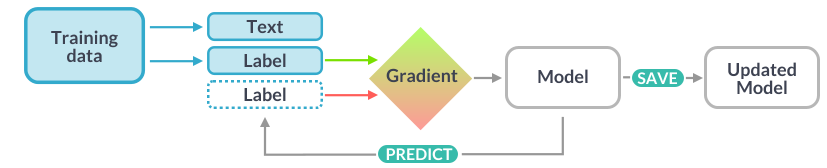

# 🗺️ Suffolk Archives NER Pipeline


This project was developed for my **Information Engineering module** at university. It implements a Named Entity Recognition (NER) pipeline to automatically identify historically significant references in digitised map and document collections from **Suffolk Archives**. The goal is to enrich metadata and improve public access to archival content through semantic analysis and geospatial mapping.

The system includes a user interface for uploading historical excerpts, viewing annotated entities, and exploring geocoded facilities on an interactive map.

---

## ⚙ How It's Made


### 🧠 spaCy Model Workflow

1. **Annotation**  
   Historical excerpts are manually annotated in Doccano, labeling spans of text with entity types like `FACILITY`, `DATE`, or `PERSON`.

2. **Data Conversion**  
   The `.jsonl` output is processed using `convert.py`, which:

   - Converts each example into spaCy’s binary format (`.spacy`)
   - Splits the data into training and development sets

3. **Model Training**  
   Using spaCy’s CLI and a custom `config.cfg`, the model is trained on `train.spacy` and evaluated on `dev.spacy`. This produces a pipeline in `model/model-best`.

4. **Model Inference**  
   The trained model is loaded in `annotate.py`, which:

   - Accepts user input via stdin
   - Runs prediction using the NER pipeline
   - Outputs recognised entities as JSON

5. **User Interaction**  
   The React frontend sends user text to the backend, receives annotated entities, and displays them. Facilities are geocoded using OpenStreetMap and visualized on a Leaflet map.

### 🔁 How spaCy Learns

To train the NER model, spaCy uses a gradient-based learning loop:

- **Text + Label** → fed into the model
- **Gradient** → compares predictions to labels
- **Model Update** → adjusts weights
- **Prediction Loop** → refines accuracy over time

This iterative process powers the entity recognition in your archival excerpts.



### 📚 Recognised Entity Types

The model identifies seven historically relevant entity types:

`MAP`, `DATE`, `PERSON`, `ORG`, `FACILITY`, `EVENT`, `GPE`

It achieved a **97–98% F-score** on real Suffolk map entries. The workflow supports batch processing, automation, and reproducibility - ideal for large-scale archival enrichment.

---

## 🛠️ How to Run It

### 1. Install dependencies

```bash
pip install -r requirements.txt
```

### 2️. Convert annotated data

Make sure your annotated .jsonl file (e.g. labelled.jsonl) is in the `data/` folder.

```bash
python convert.py
```

This will generate:
`train.spacy` and `dev.spacy`

### 3️. Train the model

```bash
python -m spacy train config.cfg --output ./model \
  --paths.train ./train.spacy \
  --paths.dev ./dev.spacy
```

### 4. Test the model (optional)

Use the trained model to extract entities from new text using the interactive Python terminal or a script. For example:

```python
import spacy
nlp = spacy.load("model/model-best")
doc = nlp("Extract from OS Provisional Map 1947, surveyed near Sudbury in 1911. Includes landmarks such as River Deben. Referenced in Suffolk Archives dated 13 March 1911. Thomas Elwood documented the cholera outbreak affecting the region.")
for ent in doc.ents:
    print(ent.text, ent.label_)
```

### 5. Run the Frontend

```bash
cd ui
npm install
npm start
```

> Ensure the backend is running (`node api/server.js`) on localhost:5050 to enable annotation and geocoding.
